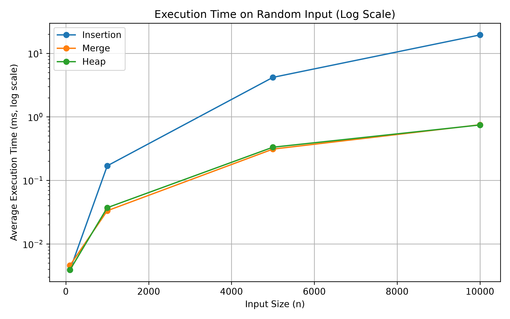
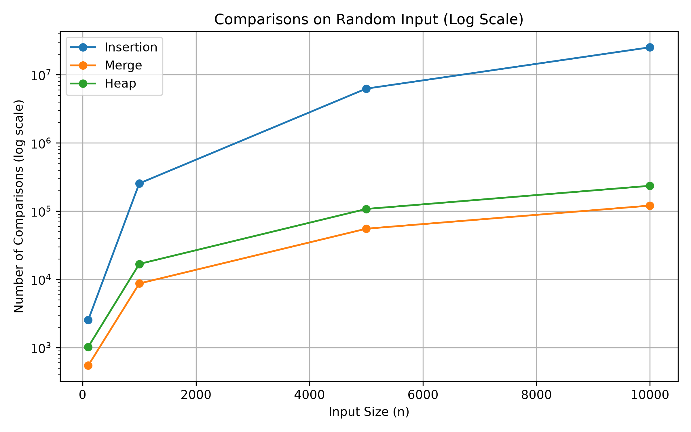
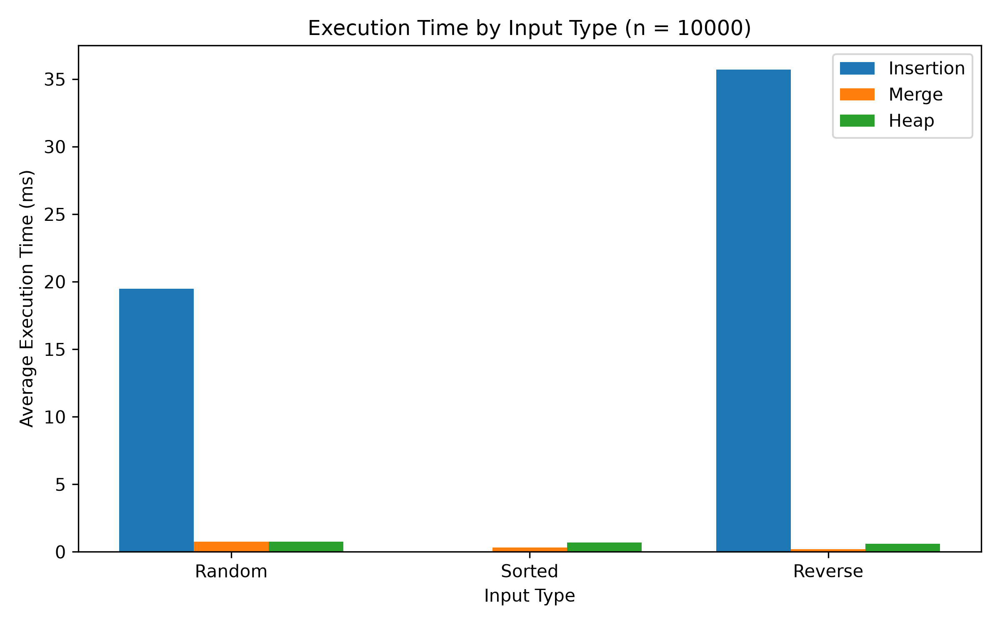

# 정렬 알고리즘 비교 보고서
## Insertion Sort · Merge Sort · Heap Sort

GitHub Repository: https://github.com/pmktim/my-algorithm-code

## 1. 과제 개요

이번 과제에서는 서로 다른 특성을 가지는 세 가지 정렬 알고리즘을 직접 구현하고 동일한 조건에서 성능을 비교하여 보았다. 수업에서 학습했던 알고리즘 중 Insertion Sort와 Merge Sort를 선택하였고 수업에서 다루지 않은 알고리즘으로는 Heap Sort를 선택하였다.

단순히 실행시간만 비교하는 것이 아닌 입력 데이터의 크기와 배열 상태에 따라 각 알고리즘의 성능이 어떻게 달라지는지 확인하고자 Random, Sorted, Reverse의 세 가지 입력 형태를 사용했다. 또한 실행시간 뿐만 아니라 원소 간 비교 횟수(comparisons)와 데이터 이동 횟수(moves)를 함께 측정했다.

추가로 세 알고리즘은 모두 C로 구현하여서 프로그래밍 언어의 차이가 실험 결과에 영향을 주지 않도록 설계했다.

# 2. 알고리즘 상세

## 2.1 Insertion Sort

Insertion Sort는 배열의 앞부분을 이미 정렬된 영역으로 간주하고 새로운 원소를 적절한 위치에 하나씩 삽입하는 방식이다.

본 구현에서는 두 번째 원소부터 시작하여 현재 원소를 `key`에 저장한 후에 왼쪽의 원소들과 비교한다. `key`보다 큰 원소가 존재하면 해당 원소를 한 칸씩 오른쪽으로 이동시키고 최종적으로 만들어진 빈 위치에 `key`를 삽입한다.

Insertion Sort의 특징으로는 입력 배열의 초기 상태에 따라 수행되는 연산량이 크게 달라진다는 점을 이야기할 수 있다. 이미 정렬된 배열의 경우 각 원소가 거의 즉시 자신의 위치에 있다는 것을 확인할 수 있으나 역순 배열에서는 새로운 원소를 삽입할 때마다 앞에 있는 대부분의 원소를 이동시켜야 한다.

따라서 일반적인 시간복잡도는 다음과 같다.

Best Case : O(n)
Average Case :  O(n²)
Worst Case : O(n²)

본 구현은 별도의 큰 보조 배열을 사용하지 않으므로 추가 공간복잡도는 O(1)이다.

## 2.2 Merge Sort

Merge Sort는 Divide and Conquer 방식을 사용하는 정렬 알고리즘이다. 배열을 더 작은 두 부분으로 반복해서 나눈 뒤 각각을 정렬하고 그렇게 정렬된 두 부분을 다시 하나의 정렬된 배열로 병합한다.

본 구현에서는 배열의 가운데 위치를 기준으로 왼쪽과 오른쪽 부분 배열을 재귀적으로 정렬했다. 이후 `merge()` 함수에서 두 정렬된 부분 배열의 원소를 비교해서 임시 배열에 작은 값부터 저장하고 병합이 완료되면 임시 배열의 값을 원래 배열로 복사했다.

배열을 반복해서 절반으로 나누기 때문에 약 log n 단계가 필요하며 각 단계의 병합 과정에서는 전체 원소에 비례하는 작업이 필요하다. 따라서 입력 배열의 상태와 관계없이 전체적인 시간복잡도는 O(n log n)이다.

Best Case : O(n log n)
Average Case : O(n log n)
Worst Case : O(n log n)

본 구현에서는 병합을 위해 임시 배열을 사용하므로 O(n)의 추가 공간이 필요하다.

## 2.3 Heap Sort

Heap Sort는 이번 과제에서 수업 시간에 학습하지 않은 알고리즘으로 선택하였으며 AI의 설명을 활용하여 원리와 구현 방법을 학습한 후 C로 구현하였다.

### AI를 통해 학습한 내용

Heap Sort를 이해하기 위해 먼저 Heap이라는 자료구조를 학습하였다. Heap은 완전 이진 트리의 형태를 가지며 Heap Sort에서는 일반적으로 부모 노드의 값이 자식 노드보다 크거나 같은 Max Heap을 사용할 수 있다.

배열을 이용하면 별도의 트리 구조를 만들지 않고도 Heap을 표현할 수 있다. 인덱스 `i`에 위치한 노드의 자식은 다음과 같이 계산할 수 있다.

- Left Child: `2 * i + 1`
- Right Child: `2 * i + 2`

Heap Sort는 크게 두 과정으로 이해하였다.

첫 번째는 주어진 배열을 Max Heap으로 만드는 과정이다. 부모 노드와 자식 노드들을 비교하여 가장 큰 값이 부모 위치에 있도록 조정하며 본 구현에서는 이 역할을 `heapify()` 함수가 수행한다.

두 번째는 완성된 Max Heap의 루트와 배열의 마지막 원소를 교환하는 과정이다. Max Heap의 루트에는 현재 Heap에서 가장 큰 값이 있기 때문에 이를 배열의 마지막으로 보내면 가장 큰 값의 위치가 확정된다. 이후 Heap의 크기를 하나 줄이고 다시 `heapify()`를 수행한다. 이 과정을 반복하면 배열 전체가 오름차순으로 정렬된다.

Heap을 구성하고 정렬하는 전체 과정의 시간복잡도는 O(n log n)이며 Merge Sort와 달리 원소 전체 크기에 비례하는 별도의 임시 배열을 필요로 하지 않는다는 특징이 있다.

Best Case : O(n log n)
Average Case : O(n log n)
Worst Case : O(n log n)

본 과제의 `heapify()`는 재귀적으로 구현하였으므로 재귀 호출에 따른 스택 공간이 사용된다.

# 3. 구현 및 실험 방법

## 3.1 구현 환경

세 정렬 알고리즘은 모두 C로 구현했다. 동일한 프로그래밍 언어와 실행 환경에서 실험함으로써 언어 자체의 실행 성능 차이가 결과에 영향을 미치는 것을 방지했다.

컴파일에는 C17 표준과 `-O2` 최적화 옵션을 사용하였다.

주요 파일의 역할은 다음과 같다.

`src/sort.h` : 정렬 함수와 `SortStats` 구조체 선언
`src/sort.c` : Insertion, Merge, Heap Sort 구현
`src/main.c` : 입력 생성, 알고리즘 실행 및 측정
`results.csv` : 실험 결과 저장
`plot_results.py` : CSV 결과를 이용한 그래프 생성

## 3.2 실험 조건

입력 크기는 다음 네 가지로 설정하였다.

- n = 100
- n = 1,000
- n = 5,000
- n = 10,000

각 크기에 대해 다음 세 가지 형태의 입력을 생성하였다.

Random: 난수로 구성된 배열
Sorted: 이미 오름차순으로 정렬된 배열
Reverse: 내림차순으로 정렬된 배열

Random 입력은 `srand(42)`로 난수 seed를 고정하여 프로그램을 다시 실행해도 동일한 실험을 재현할 수 있도록 하였다.

각 조건에서 세 알고리즘이 동일한 원본 배열을 사용하도록 정렬을 실행하기 전에 배열을 복사하였다. 배열 복사 시간은 정렬 실행시간 측정에 포함하지 않았다.

실행시간은 `clock()`을 이용하여 측정하였으며 우연한 실행시간 변동의 영향을 줄이기 위해 동일한 정렬을 10회 반복한 뒤 평균 실행시간을 계산하였다.

## 3.3 비교 횟수와 이동 횟수

실행시간은 실행 환경의 영향을 받을 수 있으므로 알고리즘 자체의 동작을 비교하기 위해 비교 횟수와 이동 횟수도 측정하였다.

`SortStats` 구조체를 사용하여 다음 두 값을 기록하였다.

- `comparisons`: 데이터 원소 사이의 비교 횟수
- `moves`: 데이터 원소가 저장되거나 이동되는 횟수

Heap Sort에서 두 원소를 교환하는 swap은 임시 변수로의 저장을 포함해서 총 3회의 이동으로 계산하였다. Merge Sort에서는 임시 배열에 값을 저장하는 과정과 임시 배열에서 원래 배열로 복사하는 과정을 모두 이동으로 계산하였다.

# 4. 실험 결과 및 분석

## 4.1 Random 입력에서 실행시간 비교

위 그래프는 Random 입력에서 입력 크기에 따른 평균 실행시간을 로그 스케일로 나타낸 것이다.

n이 작을 때는 세 알고리즘 모두 실행시간이 매우 짧은 것을 볼 수 있었지만 입력 크기가 증가하면서 차이가 뚜렷해졌다. 특히 Insertion Sort의 실행시간이 Merge Sort와 Heap Sort보다 훨씬 빠르게 증가하였다.

n = 10,000의 Random 입력에서 측정된 결과는 다음과 같다.

Insertion Sort : 19.4713ms / 25,222,903회 비교 / 25,232,913회 이동
Merge Sort : 0.7514ms / 120,536회 비교 / 267,232회 이동
Heap Sort : 0.7456ms / 235,276회 비교 / 372,267회 이동

Insertion Sort는 약 19.47 ms가 소요된 반면에 Merge Sort와 Heap Sort는 약 0.75 ms 수준이었다. 이는 입력 크기가 증가했을 때 O(n²)인 Insertion Sort와 O(n log n)인 Merge Sort 및 Heap Sort의 차이가 실제 실험에서도 나타난 결과로 볼 수 있다.

다만 n = 10,000에서 Heap Sort의 측정시간이 Merge Sort보다 약간 짧았다는 결과만으로는 Heap Sort가 항상 Merge Sort보다 빠르다고 결론 내릴 수가 없다. 두 실행시간의 차이는 매우 작고 실행시간은 실행 환경이나 측정 시점의 영향을 받을 수 있기 때문이다.

## 4.2 Random 입력에서 비교 횟수

실행시간에서 나타난 차이가 알고리즘 내부의 연산량과 어떤 관계가 있는지 확인하기 위해 비교 횟수를 분석하였다.

n = 10,000의 Random 입력에서 Insertion Sort는 25,222,903회의 비교를 수행하였다. 반면 Merge Sort는 120,536회, Heap Sort는 235,276회의 비교를 수행하였다.

입력 크기가 커질수록 Insertion Sort의 비교 횟수는 굉장히 빠르게 증가하는 반면 Merge Sort와 Heap Sort는 상대적으로 느리게 증가하였다. 이는 세 알고리즘의 이론적 시간복잡도 차이와 일치하는 경향으로 볼 수 있다.

또한 동일하게 O(n log n)의 시간복잡도를 가지더라도 Merge Sort와 Heap Sort의 실제 비교 횟수가 동일하지 않다는 것을 확인하였다. 다시 말해 Big-O 표기법은 입력 크기가 증가할 때 연산량이 증가하는 전체적인 정도를 나타내는 것이며 실제 수행되는 연산 횟수까지 같다는 의미는 아니다.

## 4.3 입력 배열 상태에 따른 실행시간

n = 10,000으로 입력 크기를 고정하고 Random, Sorted, Reverse 입력에서 각 알고리즘의 실행시간을 비교하였다.

Insertion Sort에서는 Random : 19.4713ms / Sorted : 0.0315ms / Reverse : 35.7084ms
Merge Sort에서는 Random : 0.7514ms / Sorted : 0.3365ms / Reverse : 0.1941ms
Heap Sort에서는 Random : 0.7456ms / Sorted : 0.6801ms / Reverse : 0.5890ms

가장 큰 변화는 Insertion Sort에서 나타났다. Sorted 입력에서는 약 0.0315 ms에 불과했지만 Reverse 입력에서는 약 35.7084 ms가 소요되었다.

이 차이는 비교 횟수에서도 나타난다. n = 10,000의 Sorted 입력에서 Insertion Sort의 비교 횟수는 9,999회였다. 반면 Reverse 입력에서는 49,995,000회였다.

Reverse 입력에서의 49,995,000회는 다음 식과 일치한다.

n(n - 1) / 2
= 10,000 × 9,999 / 2
= 49,995,000

따라서 본 실험에서는 Insertion Sort가 이미 정렬된 데이터에는 매우 효율적으로 작동하지만 역순 데이터에서는 매우 많은 비교와 이동을 수행한다는 것을 확인할 수 있었다.

반면 Merge Sort와 Heap Sort는 세 입력 형태 사이에서 Insertion Sort만큼 큰 성능 변화가 나타나지 않았다. 이를 통해 두 알고리즘의 경우에는 입력의 초기 정렬 상태에 상대적으로 덜 민감하다는 것을 알 수 있다.

## 4.4 이동 횟수 비교

n = 10,000의 Random 입력에서 이동 횟수는 Insertion Sort 25,232,913회, Merge Sort 267,232회, Heap Sort 372,267회로 측정되었다.

특히 본 Merge Sort 구현에서는 n = 10,000일 때 Random, Sorted, Reverse 입력 모두에서 이동 횟수가 267,232회로 동일하였다. 이는 입력 상태와 관계없이 배열을 반복적으로 분할하고 병합하면서 임시 배열에 저장한 뒤 다시 원래 배열로 복사하는 동일한 구조를 사용하기 때문인 것으로 해석할 수 있다.

Heap Sort는 Merge Sort보다 많은 비교와 이동을 수행했지만 별도의 O(n) 크기 병합용 배열을 사용하지 않는다는 차이가 있다. 따라서 알고리즘을 비교할 때는 실행시간만이 아니라 비교 횟수, 이동 횟수, 추가 공간 사용 등 여러 특성을 함께 고려할 필요가 있다.

# 5. 세 알고리즘 비교

세 알고리즘은 각각 다른 장단점을 보였다. Insertion Sort는 구조가 단순하고 이미 정렬된 입력에서는 매우 적은 비교만 필요했다. 하지만 Random 또는 Reverse 입력에서 n이 증가하면 비교와 이동 횟수가 급격하게 증가하였다.

Merge Sort는 입력 형태와 관계없이 O(n log n)의 시간복잡도를 가지며 이번 실험에서도 큰 입력에서 안정적인 성능을 보였다. 그러나 병합 과정에서 임시 배열이 필요하다는 특징이 있다.

Heap Sort 역시 O(n log n)의 시간복잡도를 유지하면서 Max Heap을 이용하여 정렬한다. 이번 과제를 통해 배열이 완전 이진 트리의 역할을 할 수 있으며 Heap의 루트에 최댓값을 유지하는 성질을 반복적으로 이용하여 전체 배열을 정렬할 수 있다는 점을 새롭게 학습하기도 했다.

# 6. 결론

본 과제에서는 Insertion Sort, Merge Sort, Heap Sort를 C로 구현하고 입력 크기와 입력 배열의 상태를 변화시키면서 실행시간, 비교 횟수, 이동 횟수를 측정해봤다.

실험 결과 Insertion Sort는 입력 상태의 영향을 크게 받았다. 특히 n = 10,000에서 Sorted 입력은 9,999회의 비교만 수행한 반면 Reverse 입력에서는 49,995,000회의 비교를 수행하였다. 이를 통해 같은 알고리즘이라도 입력 데이터의 특성에 따라 실제 성능이 크게 달라질 수 있음을 확인할 수 있었다.

Merge Sort와 Heap Sort는 입력 크기가 증가하더라도 Insertion Sort보다 실행시간과 연산 횟수가 느리게 증가하였다. 이를 통해 이론적으로 학습한 O(n²)과 O(n log n)의 차이가 실제 실험 결과에서도 나타나는 것을 확인할 수 있었다.

또한 동일한 O(n log n) 알고리즘이라고 하더라도 실제 비교 횟수와 이동 횟수, 추가 메모리 사용 방식은 서로 다르다는 점을 확인하였다. 따라서 정렬 알고리즘을 선택할 때는 시간복잡도만 확인하는 것이 아니라 입력 데이터의 상태, 실제 연산량, 메모리 사용과 같은 요소를 함께 고려해야 한다고 본다.

이번 과제를 통해 정렬 알고리즘을 단순히 코드로 구현하는 것에서 그치는 것이 아닌 동일한 조건에서 직접 측정하고 결과를 비교해보며 알고리즘의 이론적 특성이 실제 실행에서 어떻게 나타나는지 확인할 수 있었다.

# 7. 참고자료

- 수업 자료: Basic Sorting
- 수업 자료: Divide-and-Conquer and Merge Sort
- Wikipedia, "Sorting algorithm"
- Wikipedia, "Heapsort"
- AI(ChatGPT)를 활용한 Heap Sort 원리 및 구현 방법 학습
